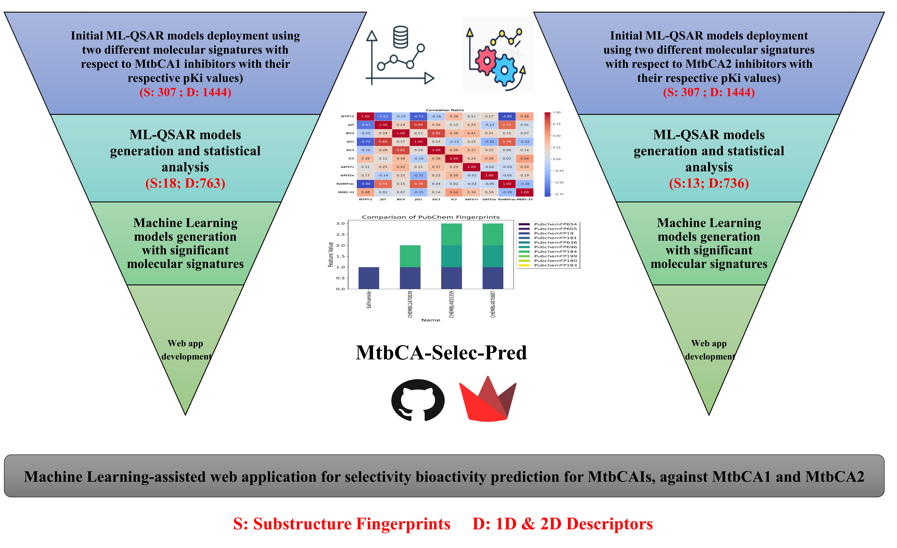

# MtbCA-Selec-Pred webserver can be found at https://mtbca-selec-pred.streamlit.app/

Project Title: Modeling the Inhibition Mechanism of Mycobacterium tuberculosis Beta-Carbonic Anhydrase Inhibitors using Integrated QSAR Approaches

Description: In this research project, the inhibition mechanisms of **Mycobacterium tuberculosis** beta-carbonic anhydrases (MtbCAs) were studied to support the development of innovative antituberculosis therapies. Machine learning-assisted quantitative structure-activity relationship (ML-QSAR) models were employed to analyze diverse molecular features, including substructure fingerprints and molecular descriptors, using random forest algorithms. These models facilitated the identification of conserved molecular signatures that distinguish selective inhibitors for MtbCA1 (e.g., SubFP1, nHBint8) and MtbCA2 (e.g., SubFP275, minHBa). Dual-selective inhibitors were further examined using ML-QSAAR models, uncovering critical structural attributes for simultaneous inhibition of both MtbCA1 and MtbCA2. To make these tools accessible, a Python-based web application, MtbCA-Selec-Pred, was developed, enabling efficient prediction of inhibitory activity against MtbCAs. These advancements provide robust tools for rational drug design, offering significant potential for developing effective antituberculosis treatments targeting MtbCAs.
